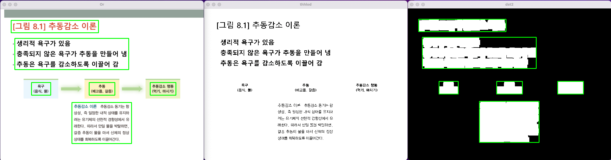

# train_LMM_labeling
It was created by a student attending Gachon University. It is a project to create a proposition and learn it from LMM under the assumption that the text from ppt is definition and explanation. Thank you for reading it.

