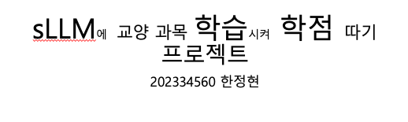
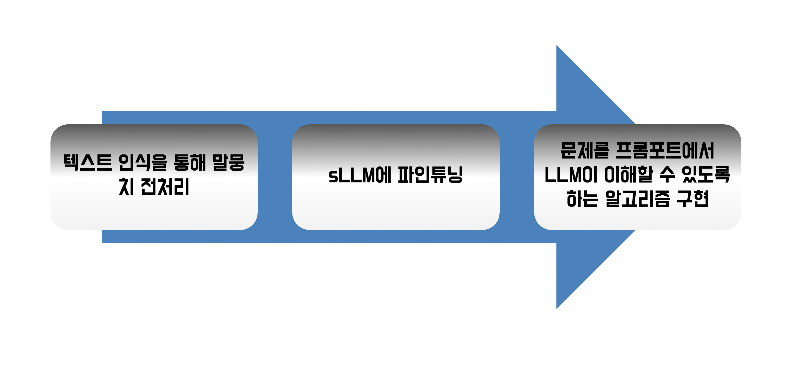
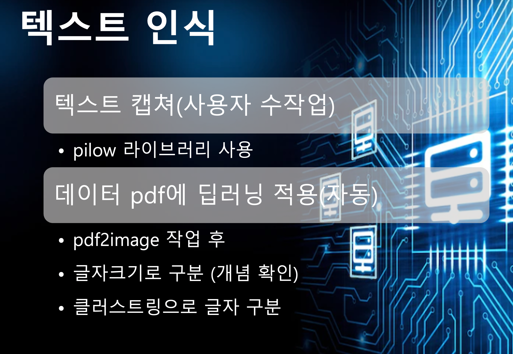
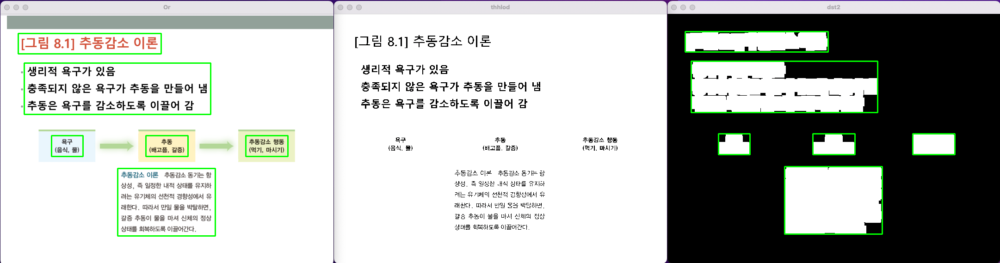

# train_LLM_labeling



It was created by a student attending Gachon University. It is a project to create a proposition and learn it from LMM under the assumption that the text from ppt is definition and explanation. Thank you for reading it.

<span style="color:red">
<h3> OUTLINE </h3>
</span>

<hr>
<br>



<span style="color:green">
 예제로 학습할 데이터셋은 "심리학의 이해" 교양 학습자료이다
</span>

 ㄴ The dataset to be learned as an example is the "Understanding Psychology" liberal arts study material


<span style="color:green">
##### 이 프로젝트에서 사용될 sLLM은 LLaMa 이다.
</span>

 ㄴ The SLMM used in this project is LLaMa.


<span style="color:green">
##### 아직 구상중이다.
</span>

 ㄴ comming soonㅋㅋ


<span style="color:red">
<h2> 말 나누기(Split text) </h2>
</span>

<hr>
<br>




### 이것은 말을 나누는 방법이다.
#### ㄴ this ways to split Text 

    1. 상위개념을 캡쳐 범위를 지정해서 타이핑없이 라벨링 하는 방법이다. 이는 정확하다는 점이 있지만 여전히 느린 단점이 존재한다.

    2. pdf를 자동으로 image로 변환 후 크기 와 위치를 통해 상위개념 하위개념을 구별, 그리고 그것들을 유기적으로 엮어 명제를 만드는 방식이다.

    issus 하지만 아직 그 명제를 질문으로 바꾸고 질 좋은 데이터로 어떻게 변화할지는 구상중이다.

ㄴ The division plans to organically utilize what is measured as being separated from the size of the writing


<span style="color:green">
<h3>
문장을 나누는 기준은 글씨의 크기와 얼마큼 떨어져있는가로 측정된 것을 유기적으로 활용할 계획이다.
</h3>
</span>

<hr>

### P L A N 1

#### 아직 만들고 있습니다.

<hr>

### P L A N 2

#### 아래 오는 이미지는 첫번째는 원본이다. 두번째는 임계값을 이용해서 검은색과 흰색으로 나눴다. 이것을 dliete를 활용해서 확장시켰고 opencv를 통해 뭉탱이로 뭉쳤다.




### result
```
253 330 211 146
추 동 감 소 이론 추 동 김 소 동 기 는 항
상 성 , 즉 일 정 한 내 적 상 태 를 유 지 하
려 는 유 기 체 의 선 천 적 경 향 성 에 서 유
래 한 다 . 따 라 서 만 일 물 을 박 탈 하 면 ,
갈 증 추 동 이 물 을 마 셔 신 체 의 정 상
상 태 를 회 복 하 도록 이 끌 어 간 다 .

530 259 91 45
추 통 감 소 행 동
( 먹 기 , 마 시 기 )

314 259 91 45
추통
'( 배 고 픔 , 갈 증 )

110 259 68 45

51 102 403 111
생 리 적 욕 구 가 있 음
충 족 되 지 않 은 욕 구 가 추 동 을 만 들 어 냄
추 동 은 욕 구 를 감 소 하 도록 이 끌 어 감

38 38 309 44

['추 동 감 소 이론 추 동 김 소 동 기 는 항\n상 성 , 즉 일 정 한 내 적 상 태 를 유 지 하\n려 는 유 기 체 의 선 천 적 경 향 성 에 서 유\n래 한 다 . 따 라 서 만 일 물 을 박 탈 하 면 ,\n갈 증 추 동 이 물 을 마 셔 신 체 의 정 상\n상 태 를 회 복 하 도록 이 끌 어 간 다 .\n', '추 통 감 소 행 동\n( 먹 기 , 마 시 기 )\n', "추통\n'( 배 고 픔 , 갈 증 )\n", '', '생 리 적 욕 구 가 있 음\n충 족 되 지 않 은 욕 구 가 추 동 을 만 들 어 냄\n추 동 은 욕 구 를 감 소 하 도록 이 끌 어 감\n', '']
```

### issue

    추통이나 욕구와 같은 한글은 인식을 잘 못함
    또한 가장 중요한 상위 개념(제목)도 인지하지 못함
    띄어쓰기도 해야함

### 1.1.1
버전 모델로 save.txt 모델을 만들었는데 정확도가 정말 처참함 사용불가 수준(하려면 사람이 다 해야함)

    save.txt 참조바람

#### 해결책 이를 해결해야함 못하면 하나하나 데이터 수정해야함


<hr>

텍스트 인식이 아닌 pdf2text로 추출했는데 정확도랑 상위개념과 하위개념을 구분도 가능해서 텍스트 인식 방안은 폐지
